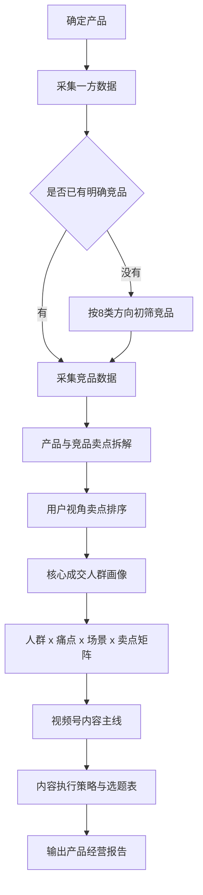

# 产品经营报告 SOP

## 作用

本 SOP 用来指导 Codex 把“产品基础信息 + 一方数据 + 竞品数据 + 自有/竞品爆款素材”整理成一份可讲解、可复用、可落地执行的产品经营报告。

它不是单纯做数据汇总，而是把数据转成内容经营决策：谁在买、在什么场景买、为什么被打动、卖点怎么排序、视频号应该打什么内容主线、下一步拍什么选题。

## 总流程

## 1. 确定产品

先固定产品基础信息，避免后面分析跑偏。

| 输出字段 | 说明 |
|---|---|
| 产品名称/类目 | 这次要分析的具体产品 |
| SKU/规格/价格 | 已知主推规格、组合、价格 |
| 当前定位 | 已有定位，没有就先写当前理解 |
| 使用场景 | 用户什么时候会用 |
| 已知卖点 | 商家当前知道或常讲的卖点 |

## 2. 采集一方数据

一方数据就是自己能拿到的全部数据，不要求每个项目都有同样的数据源，有什么就用什么。

常见来源：

- 抖店罗盘/抖音成交数据
- 巨量云图人群画像
- 视频号成交人群画像
- 商品经营数据
- 产品评价、直播间评价、退款/差评原因
- 自己的爆款素材表和素材明细

核心不是统一字段，而是把所有数据最终归到三个问题：

| 问题 | 含义 |
|---|---|
| Who | 谁在买、谁在看、谁在成交 |
| Context | 在什么生活/消费/使用场景下发生 |
| Why | 为什么被打动、为什么购买、为什么不买 |

## 3. 锁定竞品

如果用户已经明确竞品，直接采集竞品数据。

如果没有明确竞品，先用八类方向初筛：

| 竞品类型 | 用途 |
|---|---|
| 直接竞品 | 同品类、同价格带、同渠道直接竞争 |
| 同类目竞品 | 同类目下销量或内容表现好的产品 |
| 跨类目替代 | 用户用来解决同一问题的其他产品 |
| 同卖点 | 主打同样卖点 |
| 同痛点 | 解决同一个用户痛点 |
| 同场景 | 出现在同一个生活/使用场景 |
| 同人群 | 服务同一批用户 |
| 同情绪/同解决方案 | 激发同一种情绪或提供类似解决方案 |

## 4. 采集竞品数据

竞品采集至少关注三块：

| 模块 | 内容 |
|---|---|
| 竞品产品 | 规格、SKU、价格、主卖点、定位 |
| 竞品人群 | 成交人群画像、内容里点名的人群 |
| 竞品素材 | 爆款开头、内容结构、视角、转化方式、机制打法 |

## 5. 卖点拆解

用 12 类卖点做全量检查：

1. 产品包装
2. 价格
3. 工艺
4. 材料
5. 功能性
6. 场景
7. 地点/产地
8. 人群
9. 使用方法
10. 背书
11. 情怀
12. 稀缺/机制

注意：拆解不是站在工厂角度罗列事实，而是把卖点翻译成用户买点。

示例：

| 产品事实 | 用户买点 |
|---|---|
| 益生菌发酵 | 给家人吃更放心 |
| 免洗免切 | 下班回家几分钟能做一顿饭 |
| 不齁咸/减盐 | 老人孩子也更容易接受 |

## 6. 卖点排序

卖点排序按用户决策价值排，不按商家想讲什么排。

推荐顺序：

1. 场景触发卖点：用户一看就知道什么时候用
2. 信任支撑卖点：解决为什么相信你
3. 使用便利卖点：解决买回去会不会用
4. 复购/囤货卖点：解决为什么多买、反复买
5. 价格/机制卖点：解决为什么现在下单

## 7. 核心成交人群画像

视频号经营报告默认输出四类人群：

| 优先级 | 说明 |
|---|---|
| 第一主力人群 | 距离产品需求最近、最值得优先打的人 |
| 第二承接人群 | 与主力相邻，可承接转化的人 |
| 视频号核心人群 | 视频号平台上必须单独考虑的人 |
| 增量拓展人群 | 可通过新痛点、新场景、新表达拓展的人 |

固定表格：

| 优先级 | 成交人群 | 数据依据/特征 | 核心卖点 | 核心场景 | 内容语言 |
|---|---|---|---|---|---|

## 8. 内容主线

内容主线不是凭感觉写，而是从下面这个公式生成：

`卖点排序 x 核心人群 x 使用场景 x 自有/竞品素材证据`

固定表格：

| 内容主线 | 数据/分析依据 | 对应人群 | 对应卖点 | 核心场景 | 内容表达 | 作用 |
|---|---|---|---|---|---|---|

`对应人群` 必须直接写详细人群，例如“31-45 岁已育女性/家庭主理人”“50+/60+ 都市银发和小镇中老年家庭用户”，不要只写“第一主力”“视频号核心”“增量拓展”等内部标签。

## 9. 内容执行策略

执行表要能直接交给编导/达人/剪辑用。

固定字段：

| 脚本编号 | 内容主线 | 选题 | 视频分类 | 视角 | 人群 | 场景 | 开头类型 | 3秒开头来源 | 参考视频结构 | 优先级 | 执行状态 | 参考链接 |
|---|---|---|---|---|---|---|---|---|---|---|---|---|

`人群` 字段也必须直接写详细人群，方便达人、编导、剪辑不回看画像表也能理解这条视频要打谁。

视频分类只用：

- 3.1：圈定人群/种草/场景
- 3.2：信任/对比/测评/解决疑虑
- 3.99：价格/机制/收割

视角只用：

- 商家视角
- 用户视角
- 专业视角

## 10. 最终报告结构

默认输出：

1. 结论先行
2. 数据来源与使用范围
3. 产品基础信息
4. 一方数据核心判断
5. 竞品与素材打法判断
6. 产品全量卖点拆解
7. 卖点用户视角排序
8. 核心成交人群画像与卖点场景匹配
9. 视频号内容主线设计
10. 内容执行方向
11. 经营建议
12. 本次报告限制

## 11. 质量检查

交付前必须检查：

- 是否读取了用户提供的所有关键文件/链接/截图
- 是否区分了一方数据和竞品数据
- 是否说明了平台人群差异，而不是强行合并
- 是否把卖点翻译成用户买点
- 是否有四类核心人群
- 是否有视频号内容主线
- 是否有可执行选题表
- 3 秒开头是否来自素材表
- 是否没有编造价格、链接、背书、活动机制
- 如果创建飞书文档，是否创建后读取验证
